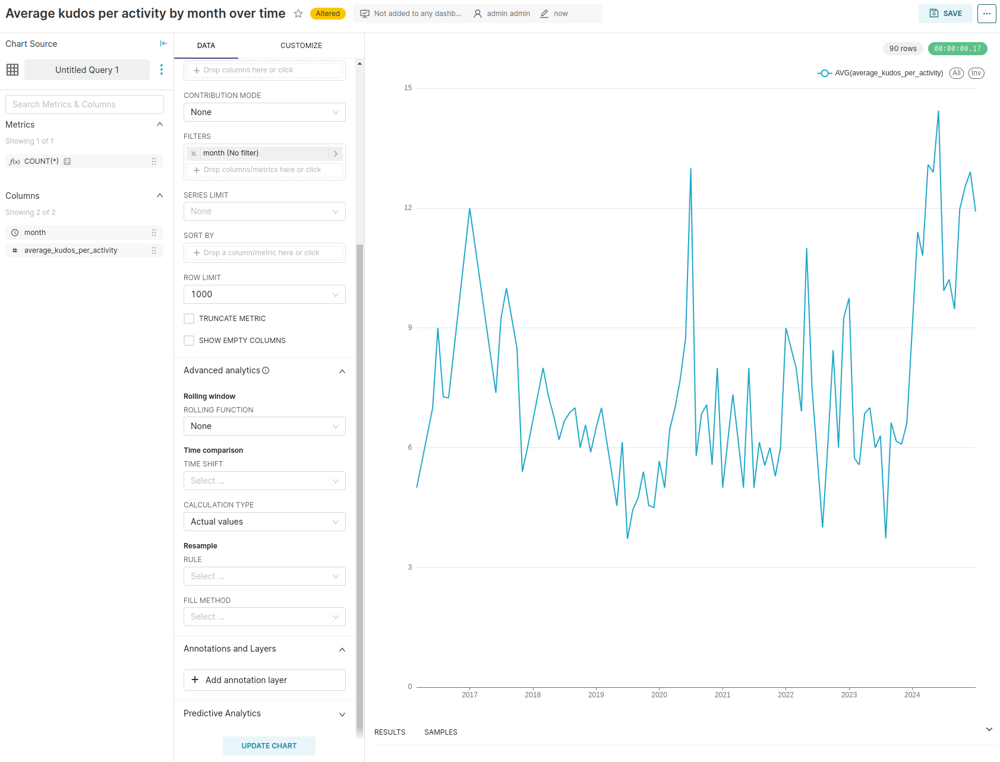
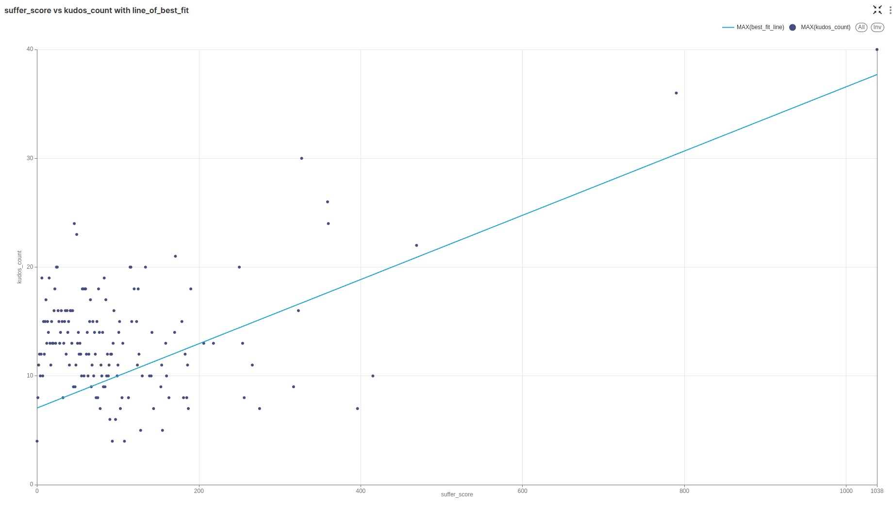

# strava-is-life

A small project to play around with Strava API

You will need PostgreSQL and to install the requirements from requirements.txt

To do this with your own data you will need to follow the Strava API instructions here:
https://developers.strava.com/docs/getting-started/
A useful YouTube video is available here:
https://www.youtube.com/watch?v=sgscChKfGyg&t=258s&ab_channel=franchyze923

Once permission is set up you will need to create a .env file with the following variables:
PG_USER=
PG_PASSWORD=
PG_DATABASE=
PG_HOST=
PG_PORT=
strava_refresh_token=
strava_client_secret=
strava_client_id=

The variables will depend on how you've set up your psql database and the others are given in the set up of
your connection to the Strava API.

The very first time you run this you will need to run setup-db.sql:
psql -f db/setup-db.sql

On strava.py you can change the number of activities requested. This is done by changing the items per page (max 200)
and the number of pages (min 1). I've left it as collecting 1000 (200,5) activities as I have under 1000 activities
on Strava, but this can be changed.

Running strava.py will use the refresh_token, client_secret and client_id to get a new access token as this changes
every 6 hours. Then it will get the atheltes information and save it to db/profile_info.json. It will also save the
athletes activities to db/activities.json. It will print out the responses from each request, and also say how many
activities it retrieved:
python db/strava.py

Running seed.py will add the following information from each activity to the strava database:
(id, name, distance, moving_time, elapsed_time, type, sport_type, location_country, kudos_count, suffer_score, date)
This could easily be tweaked to add more information:
python db/seed.py

To check that it has all worked you can run:
psql -f db/display.sql > db/display.txt
display.txt should display the most recent 50 activities.

I then set up Superset to play around with data visualisation directly from the strava database.
I won't go into detail on how I set up Superset but I roughly followed the video below.
A couple of examples:

Below is how I installed superset:
https://www.youtube.com/watch?v=IP14ArymP08&list=PLH1gsHiD7JxiqIz88CGywds8jSMUEMcs6&index=2&ab_channel=ShantanuKhond

